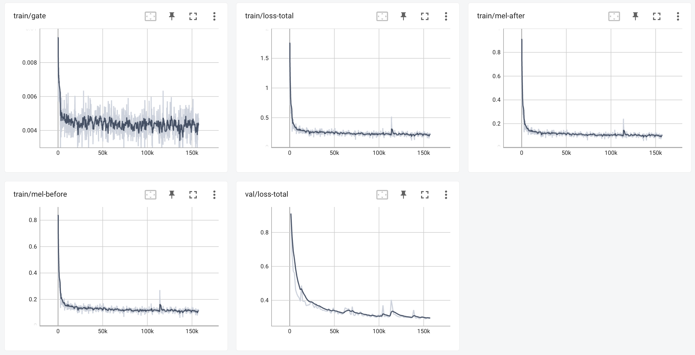

# SPEECHHOME-AISHELL-3

> 基于 Tacotron-2 实现的 AISHELL-3 多说话人语音合成实验


## 1. 目录结构
```
root
    configs/                        # 超参数配置文件
        cfg_ai3.yaml                # aishell3 训练配置文件
        ...
    hifigan/                        # HiFiGAN 模型实现
        models.py                   # HifiGAN 实现
        ...
    model/                          # Tacotron-2 模型实现
        main.py                     # Tacotron-2 训练控制
        model.py                    # Tacotron-2 实现
        hybrid_attention.py         # 混合注意力机制实现
        gmm_attention.py            # GMM 注意力机制实现
    text/                           # 文本预处理实现
    audio_processing.py             # 语音预处理工具
    data_utils.py                   # 数据集实现
    plot.py                         # 画图相关
    preprocess_ai3.py               # aishell-3 数据预处理
    train.py                        # 模型训练入口脚本
    vaildate_dataset.py             # 数据集测试
    inference.ipynb                 # 模型测试
    env.yaml                        # conda 依赖说明
    README.py                       # 说明文件
```

## 2. 利用 conda 复制项目依赖环境
```
conda env create -f env.yaml
conda activate apatheia
```

## 3. 下载并解压 AISHELL-3 数据集
参考 http://www.openslr.org/93/

## 4. 预处理 AISHELL-3 数据集
```
python preprocess_ai3.py <path-to-aishell-3>
```
这个脚本应该在 `filelists` 目录下写入 `ai3.spkids`、`ai3.test.txt`、`ai3.train.txt` 三个文本文件。
```
speechhome-ai3$ wc -l filelists/ai3*
     218 filelists/ai3.spkids
    3381 filelists/ai3.test.txt
   84654 filelists/ai3.train.txt
   88253 total
```

## 5. 训练 Tacotron-2 模型

首先检查 `configs/cfg_ai3.yaml`中的目录是否指向正确的位置；

```
python train.py configs/cfg_ai3.yaml --accelerator gpu --devices 1 --max_steps 80000
```
在（CPU资源较为紧缺的）NVIDIA TITAN RTX 上约耗时2天18小时；
期间训练脚本会向`logs/ai3_gmm/lightning_logs/version_<n>/`（n取决于第几次运行）每2小时写入一个新的checkpoint，并及时更新tensorboard。



## Acknowledgement
本项目直接引用了下列仓库代码实现：
* https://github.com/jik876/hifi-gan
* https://github.com/NVIDIA/tacotron2

The Tacotron model itself was adapted from https://github.com/NVIDIA/tacotron2.
`hifigan` is a fork from https://github.com/jik876/hifi-gan.

